## Análisis de resultados

### Efecto del radio de búsqueda

El parámetro que más impacto tiene sobre todas las métricas es el radio de búsqueda.
Al pasar de 23" a 30" a 46", la cobertura sube de ~65% a ~79% a ~94%, pero la ambigüedad
sin filtro de magnitud sube de ~24% a ~33% a ~50%. Este trade-off es el esperado y refleja
que Gaia es mucho más denso que el CD: a mayor radio, se capturan más contrapartes
verdaderas pero también más contaminantes.

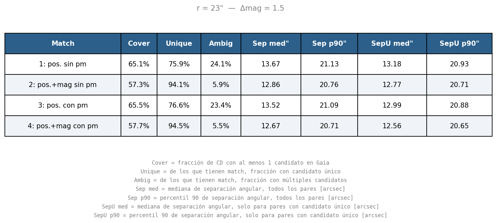
*Tabla de métricas para r = 23"*

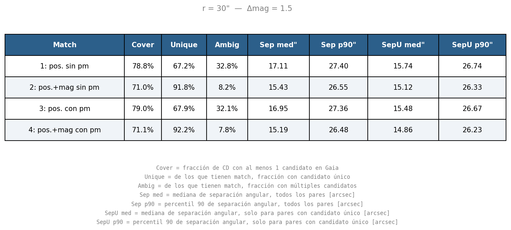
*Tabla de métricas para r = 30"*

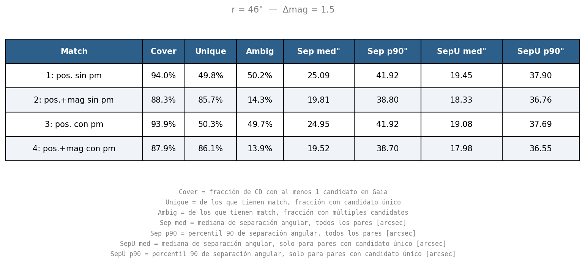
*Tabla de métricas para r = 46"*

Algo destacable es que las tendencias relativas entre los cuatro matches se mantienen en
los tres radios. El filtro de magnitud siempre reduce la ambigüedad drásticamente, y la
propagación siempre mejora levemente la cobertura y la separación mediana. Esto indica que
las conclusiones son robustas frente a la elección del radio dentro del rango explorado.

---

### Efecto del filtro de magnitud

El filtro de magnitud es el factor que más reduce la ambigüedad. En todos los radios, pasar
del match solo posicional al match con filtro reduce la fracción de ambiguos de forma muy
pronunciada:

| Radio | Ambig. sin filtro | Ambig. con filtro |
|-------|-------------------|-------------------|
| 23"   | 24.1%             | 5.9%              |
| 30"   | 32.8%             | 8.2%              |
| 46"   | 50.2%             | 14.3%             |

Aunque esto es una justificación fuerte para su uso, el filtro tiene un costo en cobertura
consistente en los tres radios: aproximadamente 7–8 puntos porcentuales de pérdida. Esta
pérdida tiene múltiples causas posibles, incluyendo:

- **Contrapartes correctas rechazadas** por imprecisiones en la cadena de conversión de
  magnitudes (Gaia → Johnson V → escala CD), cuya incerteza total es ~0.3 mag.
- **Errores de transcripción en I/114**, para los cuales la magnitud en el CD es incorrecta
  y ningún candidato pasa el filtro.
- **Tipos espectrales atípicos** para los que la conversión es menos precisa, como estrellas
  muy rojas, o estrellas variables.

Un factor adicional es que las fuentes de Gaia sin fotometría BP o RP (0.7%) son excluidas
automáticamente por el filtro, introduciendo un sesgo hacia estrellas con fotometría
completa en Gaia.

---

### Efecto de la propagación por movimiento propio

A nivel global, la propagación tiene un efecto pequeño pero consistente. La cobertura mejora
marginalmente (~0.2–0.4 puntos porcentuales) y la separación mediana baja levemente en
todos los radios. Estos efectos son pequeños porque la gran mayoría de las estrellas del CD
tienen movimientos propios pequeños. En 141 años, un movimiento propio de 10 mas/año produce
un desplazamiento de solo ~1.4", menor que cualquier tolerancia razonable dada la precisión
del CD.

La distribución de separaciones angulares ilustra este punto: los cuatro matches se solapan
casi completamente, con diferencias apenas perceptibles entre el match con y sin propagación.

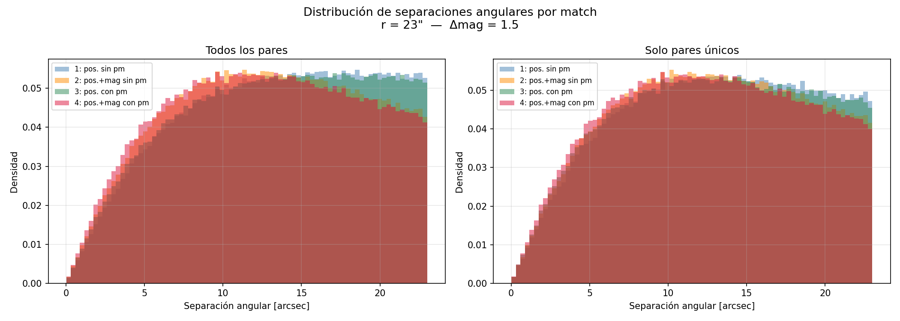
*Distribución de separaciones angulares para los cuatro matches, r = 23"*

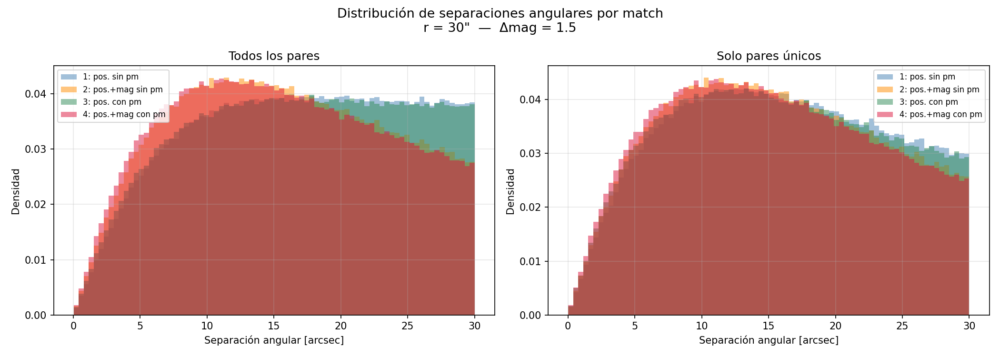
*Distribución de separaciones angulares para los cuatro matches, r = 30"*

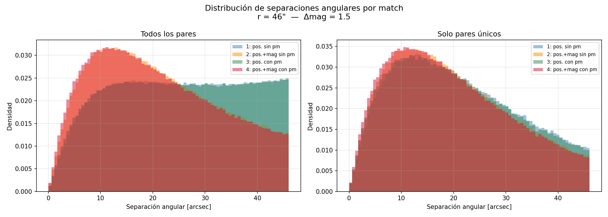
*Distribución de separaciones angulares para los cuatro matches, r = 46"*

El efecto de la propagación se vuelve claro y estadísticamente significativo al estratificar
por módulo de movimiento propio. Para estrellas con pm < 50 mas/año, las distribuciones de
separación con y sin propagación son prácticamente idénticas en todos los radios, con
diferencias de mediana de 0.1" o menos. Para estrellas con pm ≥ 50 mas/año, la propagación
reduce la separación mediana de forma consistente:

| Radio | Sep. med. sin prop. | Sep. med. con prop. | Reducción |
|-------|---------------------|---------------------|-----------|
| 23"   | 14.0"               | 12.4"               | 1.6"      |
| 30"   | 16.8"               | 14.6"               | 2.2"      |
| 46"   | 21.1"               | 18.0"               | 3.1"      |

Se observa además que el match con propagación tiene consistentemente más pares que el match 
sin propagación en ambos subconjuntos de pm. Para pm < 50 mas/año la diferencia es marginal 
(~0.1–0.3%), mientras que para pm ≥ 50 mas/año el efecto es sustancial y decrece con el radio: 
+18% a r = 23", +11% a r = 30" y +4% a r = 46". Esto es coherente con la lógica del método: 
a radio chico, más estrellas de pm alto quedan fuera de la tolerancia sin propagar y son 
recuperadas al hacerlo; a radio grande, la tolerancia ya era suficientemente amplia para 
capturarlas sin necesidad de propagar.

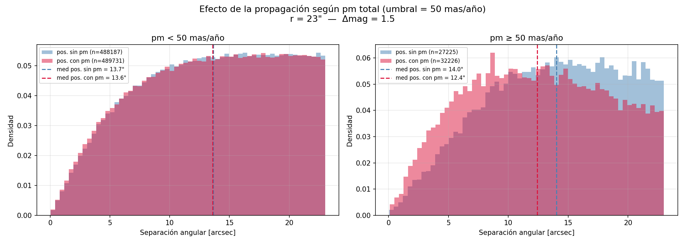
*Efecto de la propagación según pm total, sin filtro de magnitud, r = 23"*

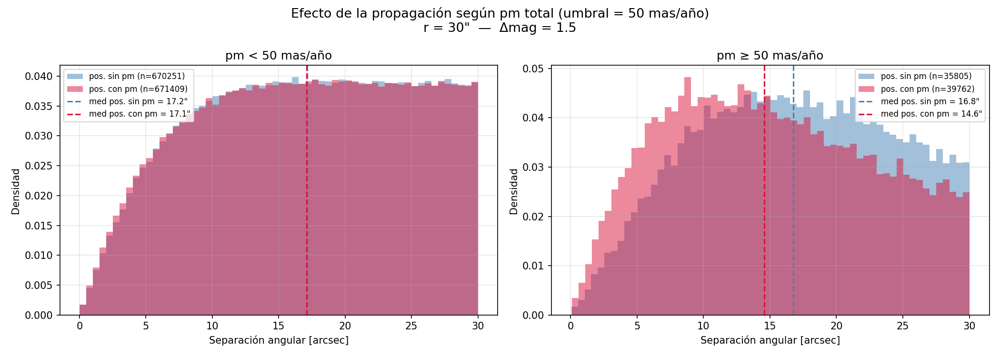
*Efecto de la propagación según pm total, sin filtro de magnitud, r = 30"*

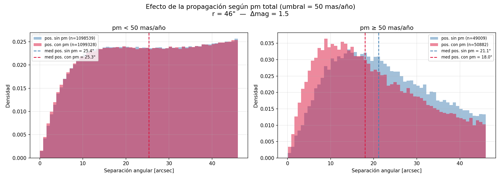
*Efecto de la propagación según pm total, sin filtro de magnitud, r = 46"*

---

### Interacción entre propagación y filtro de magnitud

El efecto de la propagación sobre la distribución de separaciones es prácticamente idéntico
con y sin filtro de magnitud, para todos los radios explorados. Esto indica que los dos
criterios actúan de forma independiente: el filtro de magnitud selecciona o descarta
candidatos basándose en fotometría, y la propagación los acerca o aleja posicionalmente,
sin que uno interfiera con el otro. Esta independencia es metodológicamente conveniente
porque permite interpretar las mejoras de forma aditiva.

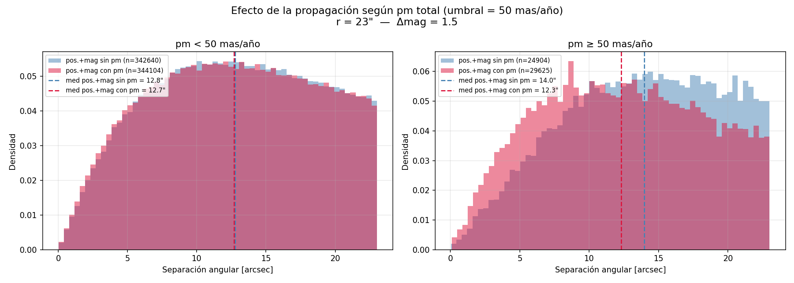
*Efecto de la propagación según pm total, con filtro de magnitud, r = 23"*

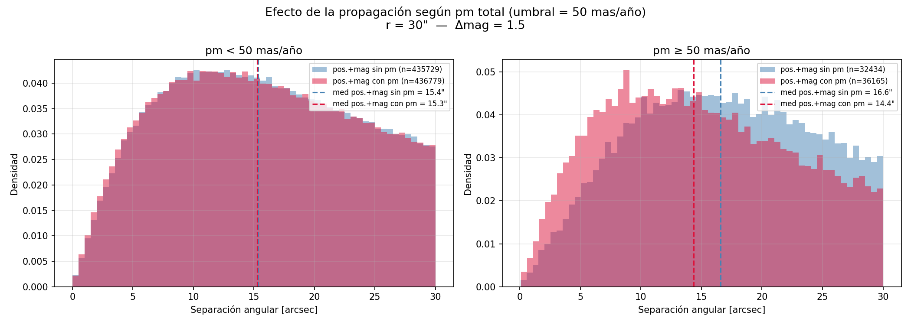
*Efecto de la propagación según pm total, con filtro de magnitud, r = 30"*

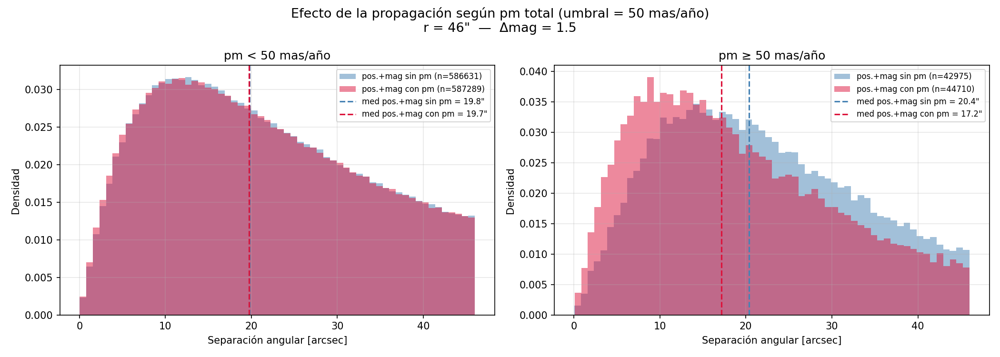
*Efecto de la propagación según pm total, con filtro de magnitud, r = 46"*

---

### Limitaciones y consideraciones metodológicas

**Conversión de magnitudes.** El polinomio de Severin & Sevilla (2015) fue calibrado sobre
declinación -23° y sobre el ~25% de estrellas del CD con identificación previa, que tienden
a ser las más brillantes y fáciles de identificar. Su validez para otras declinaciones y para
estrellas tenues o de tipos espectrales atípicos no está garantizada. Esto no invalida el
filtro pero sí limita su confiabilidad en partes del catálogo fuera del rango de calibración.

**Propagación lineal.** La propagación asume movimiento rectilíneo uniforme. Aunque es una
aproximación razonable para la mayoría de las estrellas en 141 años, en algunos casos puede
no representar el movimiento real.

**Sesgo de la muestra resultante.** El CD llega a magnitud visual ~12, lo que significa que
el crossmatch representa solo las estrellas más brillantes de Gaia. Los matches con
propagación están adicionalmente sesgados hacia estrellas con solución astrométrica completa
en Gaia. Los matches con filtro de magnitud agregan un sesgo hacia
estrellas con fotometría BP/RP disponible en Gaia. Cualquier análisis estadístico derivado
del catálogo resultante debe tener en cuenta estos sesgos acumulados.

**Ausencia de separación clara entre señal y ruido.** En un match entre catálogos de alta
precisión se esperaría un pico pronunciado cerca de 0" en la distribución de separaciones,
seguido de una cola plana de contaminantes, lo que permitiría establecer un criterio de corte
limpio. Lo que se observa es una distribución ancha sin separación visible, consecuencia
directa del error posicional del CD (~10–23"). Esto implica que la fracción de contaminantes
en el resultado final es difícil de cuantificar sin una muestra de validación externa con
identificaciones conocidas.